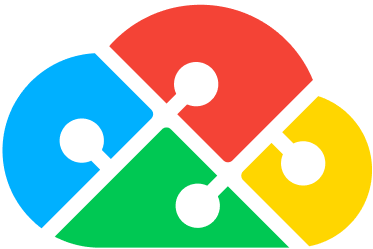
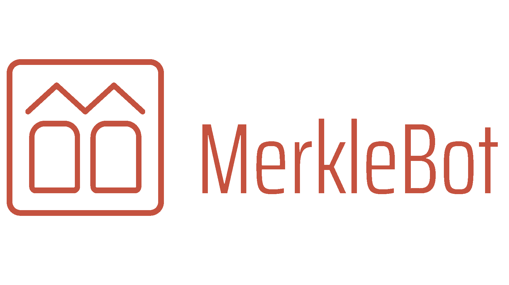
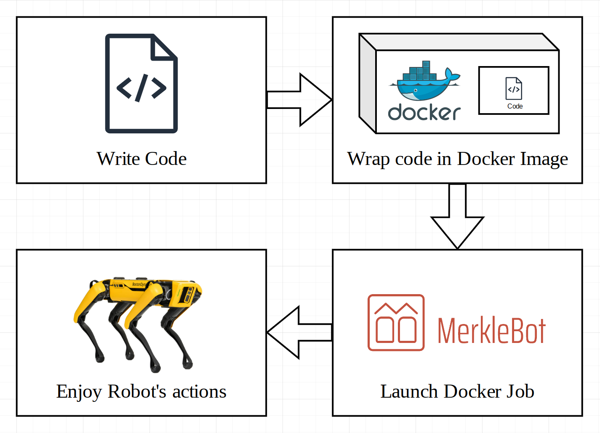

<a name="readme-top"></a>

<!-- PROJECT LOGO -->
<br />
<div align="center">
  <a href="https://duplocloud.com/">
    
  </a>
</div/>
<div align="center">
  <a href="https://merklebot.com/">
    
  </a>
</div/>
<div>
<h3 align="center">DuploCloud and MerkleBot Present Robo-Hackathon</h3>

  <p align="center">
    A default repository for your hackathon needs, brought to you by DuploCloud and MerkleBot
    <br />
    <a href="https://docs.duplocloud.com/docs"><strong>Explore our docs »</strong></a>
    <br />
    <br />
    <a href="https://duplocloud.com/platform/">View our Demo</a>
  </p>
</div>


<!-- TABLE OF CONTENTS -->
<details>
  <summary>Table of Contents</summary>
  <ol>
    <li>
      <a href="#about-the-project">About The Hackathon</a>
    </li>
    <li>
      <a href="#getting-started">Getting Started</a>
      <ul>
        <li><a href="#prerequisites">Prerequisites</a></li>
        <li><a href="#installation">Installation</a></li>
      </ul>
    </li>
    <li><a href="#usage">Usage</a></li>
    <li><a href="#contact">Contact</a></li>
    <li><a href="#acknowledgments">Acknowledgments</a></li>
  </ol>
</details>


<!-- ABOUT THE PROJECT -->
## About The Project

Using this project template you will be able to get started that much faster to with the hackathon. This project template contains a github action that will build a Dockerfile and store it within GitHub Container registry and the container will then be pulled by MerkleBot to deploy onto your robots.

<p align="right">(<a href="#readme-top">back to top</a>)</p>


<!-- GETTING STARTED -->
## Getting Started

**This image contains basic commands to work with camera, microphone and speaker at Spot's computer**

## Image link
Image link could be acquired in **packages** section of the main repository page

## How to use
The container for this image should be runned with flags `--device /dev/video0` and `--device /dev/snd`.
Also, environmental varialbes `-e SDL_AUDIODRIVER='alsa'`, `-e AUDIODEV='hw:1,0'`, `-e AUDIO_INPUT_DEVICE='hw:2,0'` shoud be added.

Basic example contained in _main.py_ 

### Prerequisites
#### git
  ```sh
  # for MAC
  brew install git
  # for Linux
  sudo apt update && apt install git
  # for Windows
  # go to https://git-scm.com/download/win
  ```
#### python
  ````sh 
  # for MAC
  brew install python
  # for Linux
  sudo apt update && apt install python3
  # for Windows
  # go to https://www.python.org/downloads/windows/
  ````
#### Text Editor
We are a fan of VS Code but feel free to use anything from notepad or sublime to an full blown IDE from JetBrains or Visual Studio

## Schema
<br />
<div align="center">
  <a href="https://github.com/Robo-Hackathon/team-A">
    
  </a>
</div>

### Instructions

Get the instructions at [our notion doc](https://www.notion.so/merklebot/Docs-for-RoboHackathon-b057d24828194c78bac53a3885305382)

<p align="right">(<a href="#readme-top">back to top</a>)</p>

<!-- CONTACT -->
## Contact

Carlos Hernandez - [carlos@duplocloud.net](carlos@duplocloud.net)
<!-- Project Link: [https://github.com/Robo-Hackathon/team-A](https://github.com/Robo-Hackathon/team-A) -->

<p align="right">(<a href="#readme-top">back to top</a>)</p>

<!-- ACKNOWLEDGMENTS -->
## Acknowledgments

* [DuploCloud](duplocloud.com) for sponsoring this event
* [MerkleBot]() for hosting this event
* [Ian](ian@duplocloud.net) for supporting this event
* [Abigail](abigail@duplocloud.net) for coordinating sponsorship and supporting this event

<p align="right">(<a href="#readme-top">back to top</a>)</p>
